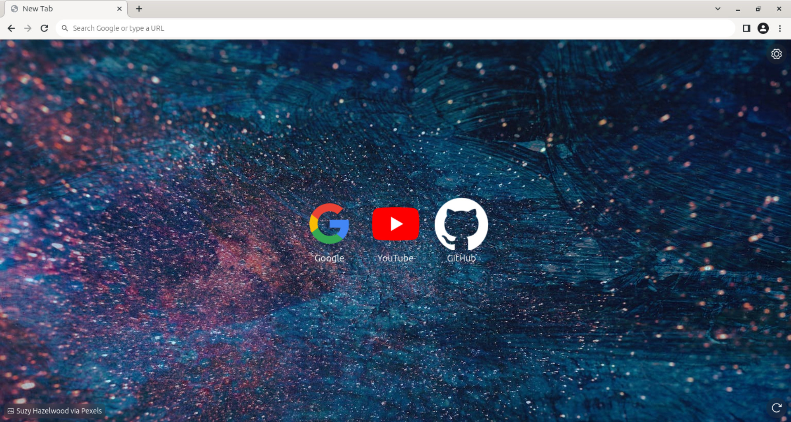
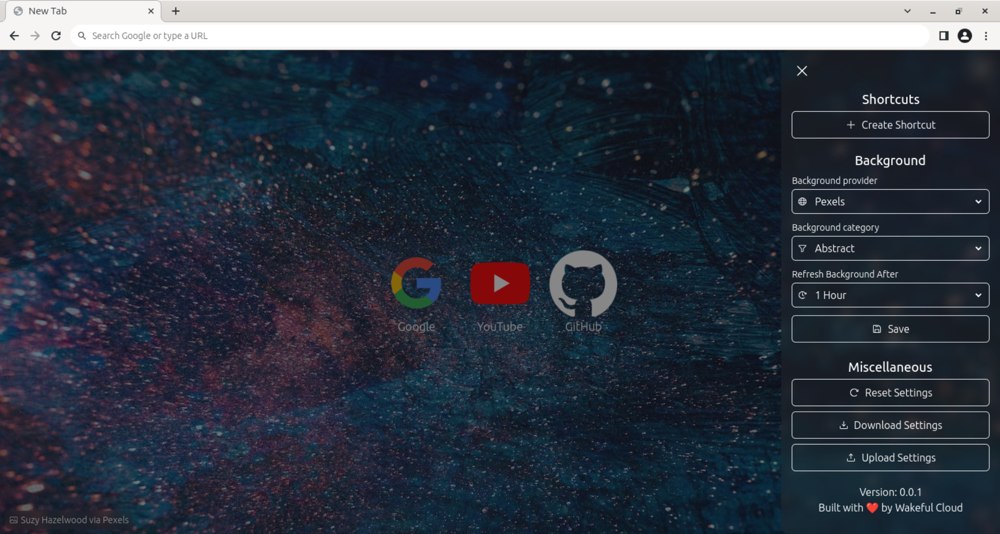
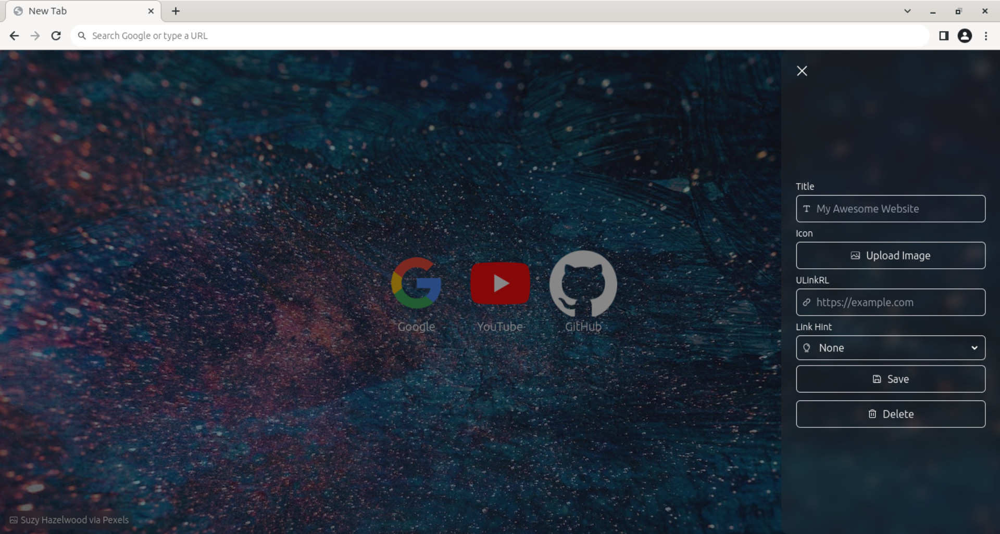

# New Tab

[](https://github.com/wakeful-cloud/new-tab/actions/workflows/cd.yml)

A simple browser extension that displays a random image along with bookmarks on the new tab page. Compatible with all Chromium-based browsers (Brave, Chrome, Edge, Opera, Vivaldi, etc.) and Firefox. Built with [Solid](https://solidjs.com), [UnoCSS](https://unocss.dev)/[Tailwind](https://tailwindcss.com), and [Vite](https://vitejs.dev).







## Documentation

### Installation

#### Chromium-based Browsers (Packed)

1. [Download the `new-tab.crx.disabled` file from the latest release](https://github.com/wakeful-cloud/new-tab/releases/latest/download/new-tab.crx.disabled)
2. Rename `new-tab.crx.disabled` to `new-tab.crx`
3. Go to `chrome://extensions` (regardless of which browser you're using)
4. Drag the downloaded `new-tab.crx` file onto the page (it's a little finicky and can take a few attempts to work)
5. Click `Add extension`

> [!NOTE]  
> If this method doesn't work, try the unpacked method below.

#### Chromium-based Browsers (Unpacked)

> [!TIP]
> Try the packed method first, as it's easier, faster, and (slightly) more secure.

1. [Download the `new-tab.zip` file from the latest release](https://github.com/wakeful-cloud/new-tab/releases/latest/download/new-tab.zip)
2. Extract `new-tab.zip` to a permanent location
3. Go to `chrome://extensions` (regardless of which browser you're using)
4. Enable developer mode
5. Click `Load unpacked`
6. Select the extracted `new-tab` folder

> [!NOTE]  
> If you accidentally delete the extracted `new-tab` folder, you will have to reinstall the extension.

#### Firefox

1. [Download the `new-tab.xpi` file from the latest release](https://github.com/wakeful-cloud/new-tab/releases/latest/download/new-tab.xpi)
2. Click `Add`

### Development

#### Setup

1. Clone the repository:

```sh
git clone https://github.com/wakeful-cloud/new-tab.git
```

2. Install dependencies:

```sh
npm install
```

3. Start the development server:

```sh
npm run dev
```

4. Build the extension:

```sh
npm run build
```

#### Environment Variables

| Name                       | Description                                                        | Default/Required |
| -------------------------- | ------------------------------------------------------------------ | ---------------- |
| `VITE_PEXELS_API_KEY`      | [API key for Pexels](https://www.pexels.com/api/new/)              | Required         |
| `VITE_UNSPLASH_ACCESS_KEY` | [Access key for Unsplash](https://unsplash.com/oauth/applications) | Required         |
